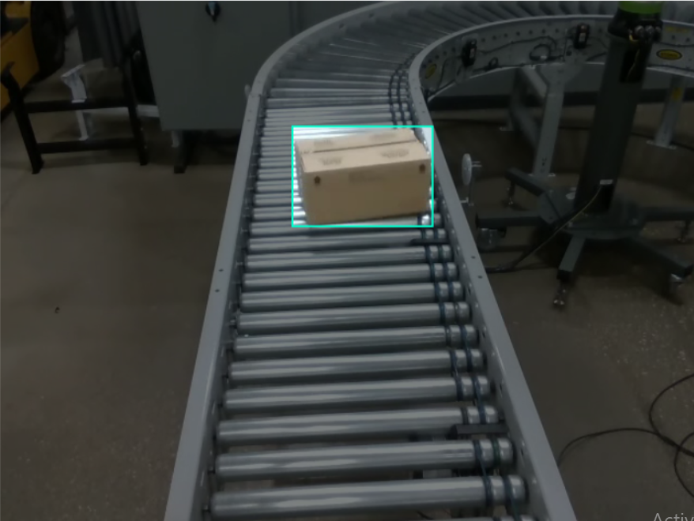

# Conveyor Box Detection System (YOLO26)

This project implements a high-speed computer vision solution for detecting boxes on industrial production lines. Using the YOLO26n architecture, the model provides real-time inference suitable for integration with automated conveyor systems.



## 🚀 Performance
* **Accuracy:** 90% mAP (mean Average Precision)
* **Model:** YOLO26n (Nano)
* **Target:** Industrial Packaging / Cardboard Boxes

## 📂 Project Structure

The repository is organized following the standard Ultralytics/Roboflow format for seamless training and deployment:

```text
├── conveyor-1/             # Dataset directory
│   ├── train/              # Training images and labels
│   ├── valid/              # Validation set for hyperparameter tuning
│   ├── test/               # Test set for final evaluation
│   │   ├── images/         # Raw industrial images
│   │   └── labels/         # YOLO format annotations (.txt)
│   ├── data.yaml           # Dataset configuration (classes, paths)
│   └── README.roboflow.txt # Dataset origin info
├── runs/                   # Training logs and weights
│   └── detect/             # Detection results and exported models
├── yolo26n.pt              # Final trained model weights
└── README.md               # Project documentation
